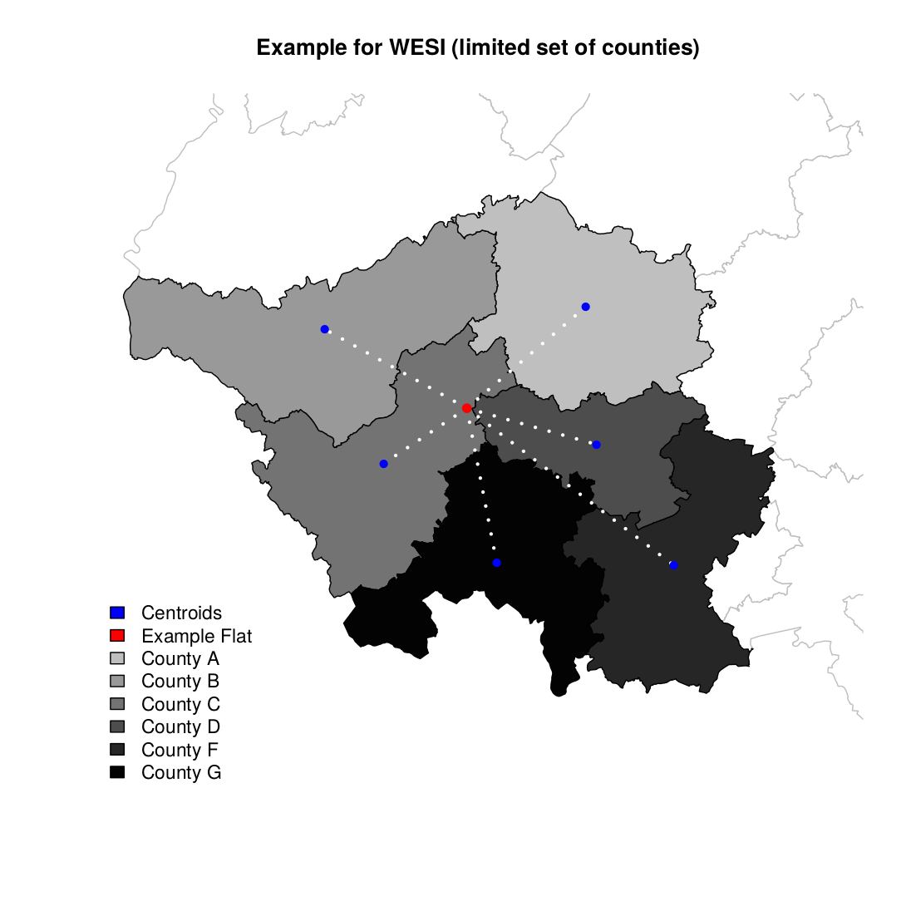

# Declining influence over geographical distance

 **[Back to the Overview](./index.html)**

## Background

At the end of last year (Dec. '17), I finished my Bachelor's thesis about the
influence of the economic strength of geographic regions on their rental prices.
For this hedonic regression, data on roughly 90000 rental flats within Germany
was gathered, including indicators about the quality and *configuration* of
these flats, as well as the exact geographic location. While the former were
used as control variables, the latter found use in matching the economic
strength of a region to said flats.

Measuring "economic strength" is not as trivial as it may sound either. There is
no clearly defined indicator for this, when it comes to sub-regions within a
country. On a supra- or national level, economists usually use the
[GDP](https://en.wikipedia.org/wiki/Gross_domestic_product) today, however there
often is no such measure for regions within a country. It is however possible to
gather tax data on smaller regions within Germany, namely on countries, counties
and even cities, due to its federalistic structure.

It is important to find a good balance between size of these regions (generally,
you want as small regions as possible), supply of data as well as clarity. In
the case of Germany, it makes sense to choose counties, as they usually provide
a lot of useful data and do not vary as much in geographic size as other
categorizations. Additionally, 401 segments seems like a manageable amount. Most
importantly, counties vary greatly when it comes to economic strength, which
means, that the economic model is able to discriminate between these regions
easily.

Choosing this partition does have its downsides however. For one, economic
strength of a county may be influenced by the country it is in. Germany's
"vertical revenue equalization" could *strengthen* a county, even though it does
not contribute to that itself, by providing good jobs and attractive living
conditions. However, that would be the basis of the hypothesis that rental flats
in *stronger* regions are more expensive than those in *weaker* regions.

Secondly, these predefined regions could influence one another, based on their
spatial distance. A very *strong* county may raise rental prices not only within
its own borders, but also in neighbouring counties - and depending on their size
and "mobility" of the workforce - in even more than that. In order to counter
this issue,
["Zones of Mobility in the Workforce" have been defined multiple times before](https://doi.org/10.1080/00343404.2014.923093).
These regions are crafted, so they also reflect catchment areas. This results in
regions with very high commuting within and almost none between them. The
problem with this approach is its artificial nature. These are not
administrative regions, thus there is no data on their economic or financial
state.

> This blog post discusses the solution used in my Bachelor's thesis and its
> limitations in my exact use case. Furthermore, I want to stimulate discussion
> on how to improve the model and alternatives to it.

## Weighted Economic Strength per Inhabitant

In order to measure *economic strength* of a region, the
"communal fiscal capacity" (ger.: "gemeindliche Steuerkraft") was used. It
includes not only the "real fiscal capacity" of said region, but also the
communal share of the income and turnover tax, excluding the apportionment of
the occupational tax. Authorities provide this data for each 401 county in
[every year](https://www.destatis.de/DE/Publikationen/Thematisch/FinanzenSteuern/AlteAusgaben/RealsteuervergleichAlt.html).

As mentioned before, it is rather imprecise to simply match each rental flat to
the *economic strength* of the county it is located in. It is safe to assume at
least some level of influence between neighbouring counties.

As the real form of the effect is unknown, an assumption has to be made. It
makes sense, that the level of influence of a region's *economic strength* on a
flat's rental price declines with rising spatial distance between each other.
Due to the lack of proper empirical evidence and research by others, a simple
inverse form was used:

\ 

*With:*

- *wesi: Weighted Economic Strength per Inhabitant*
- *esi: Economix Strength per Inhabitant*
- *d: spatial distance*
- *f: representing each rental flat in the sample*
- *c: representing each of the 401 counties*

The "spatial distance" was defined as the geodesic distance between the spatial
location of the flat (defined by its latitude and longitude) and the centroid of
the county's geographic area.

This results in an indicator which is able to assign each flat of a county
differing values regarding economic strength, depending on their exact location.
If a flat within a *weaker* county is close to the border of a *stronger* one,
it will have a much higher *wesi* than an identical flat within that *weaker*
county which has a higher spatial distance to the *stronger* one.

\ 

It should be clear, that this indicator is problematic in multiple ways. The
influence is assumed to be of the same form for all Germany, however it is not
certain, that this reflects the reality. Also, an inverse course was assumed,
however this decision was not based on empirical research of theoretical
indication, but rather convenience. Additional research has to be done in order
to clarify, which form the gradual reduction of influence has. Thus *WESI*
should be seen as an approximation and proof of concept at best.

In my case *WESI* proofed to be a reliable factor in the hedonic regression. I
may be able to share the results in the near future, however this blog post
simply discussed the initial issue and idea behind *WESI*, which has been
crafted to tackle it.

If you have further comments, idea or inspiration, please
[mail me](mailto:jayviiATposteoDOTde) or find me on Social Platforms.

---

## Author

This post has been written by [Jan "JayVii"](mailto:jayviiATposteoDOTde) on
March 30th 2018.
